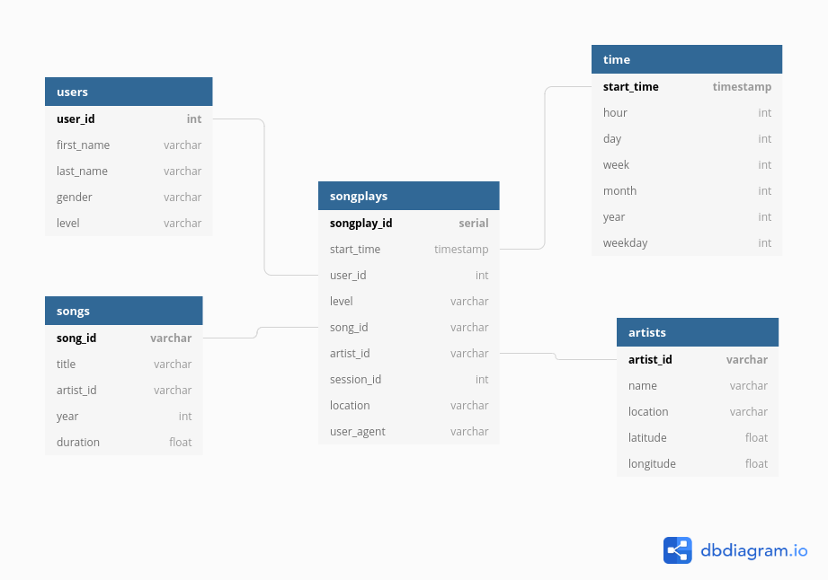

# Sparkify Apache Spark

## Description
This project contains files to create a Data Lake getting the data from S3 buckets and creating Dataframes with Apache spark.

- Songs dataset: The first dataset is a subset of real data from the [Million Song Dataset](http://millionsongdataset.com/). Each file is in JSON format and contains metadata about a song and the artist of that song. The files are partitioned by the first three letters of each song's track ID.

    Each JSON file looks like.

    ```
    {
        "num_songs": 1,
        "artist_id": "ARJIE2Y1187B994AB7"
        "artist_latitude": null,
        "artist_longitude": null,
        "artist_location": "",
        "artist_name": "Line Renaud",
        "song_id": "SOUPIRU12A6D4FA1E1",
        "title": "Der Kleine Dompfaff",
        "duration": 152.92036,
        "year": 0
    }
    ```


- Logs dataset: consists of log files in JSON format generated by this event simulator based on the songs in the dataset above. These simulate app activity logs from an imaginary music streaming app based on configuration settings.

    


## Connection to S3 buckets. 
dwh.cfg file has the needed credentials to connect to AWS.


## Creating artists and songs tables.

We can create this tables easily using a spark instance and reading the data like following example:
```python
# get filepath to song data file
song_data = f"{s3_base_path}song_data/*/*/*/*.json"
    
# read song data file
df = spark.read.json(song_data)

# extract columns to create songs table
songs_table = df.select("song_id", "title", "artist_id", "year", "duration").distinct()
```
Additionally this tables will be saved within S3 buckets in parquet extension like this:

```python
songs_table.write.mode("overwrite").partitionBy("year","artist_id").parquet(f"{output_data}/songs_table.parquet")
```

Parquet files allows us to get similar functionality like columnar databases and in this case, we are partitioning the data by ```year``` and ```artist_id```.


## Creating star schema: songplays, time, songs.




To create this new tables, we need to extract data from log_data dataset. Hence this new section contains the creation of a time table, we need to use the SQL functions by PySpark to process the datetime data and convert to days, hours, weeks and so on.

```python
time_table = df.select(
    col("datetime"),
    hour("datetime").alias("hour"), 
    dayofmonth("datetime").alias("day"), 
    weekofyear("datetime").alias("week"),
    month("datetime").alias("month"),
    year("datetime").alias("year"),
    dayofweek("datetime").alias("weekday")
).distinct()
```
Also, we need to be able to get the datetime data from timestamp. Then, we create a user defined function like this:

```python
get_datetime = udf(lambda x: str(datetime.fromtimestamp(int(x) / 1000.0)))
df = df.withColumn("datetime", get_datetime(df.ts))
```

## Execution flow:

1. Etl calls ```create_spark_session``` to create the spark session instance.
2. Executes ```process_song_data``` and ```process_log_data```:
    - Gets the data from s3 bucket.
    - Selects the needed columns.
    - Creates each dataframe.
    - Wrrites parquet files in S3 bucket.

## If you want to run this.

1. Create an IAM role with access to S3 on AWS.
2. Fill credentials on ```dwh.cfg``` file in order to get credentials from ```etl``` file.
3. Run etl file.
